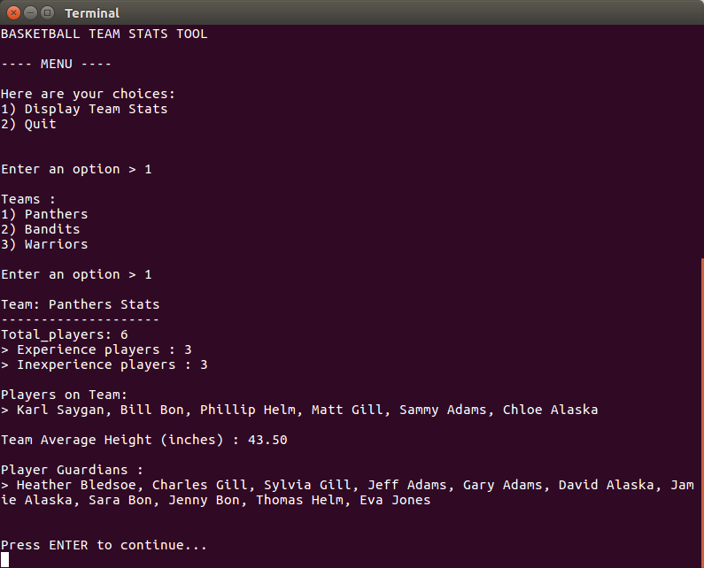

# Basketball Team Stats Tool
Python Web Development TechDegree **Project 2 - Basketball Team Stats Tool**

## Description

In this project you will be writing a program that reads from the "constants" data (`PLAYERS` and `TEAMS`) in `constants.py`. This data will need to be translated into a new data structure to store and organize a team of Basketball players into distributed teams. This tool will not only balance the teams by the total number of players but also let you generate some statistics for a given team.

## Instructions:

run `python app.py`

Note: you should have Python 3.6 or later installed in your computer.

## File Description
There are 3 function available :
- `app.py` : as main function to run the app.
- `constants.py` : to store player data.
- `helper.py` : as utilities function and also to clean player data.
